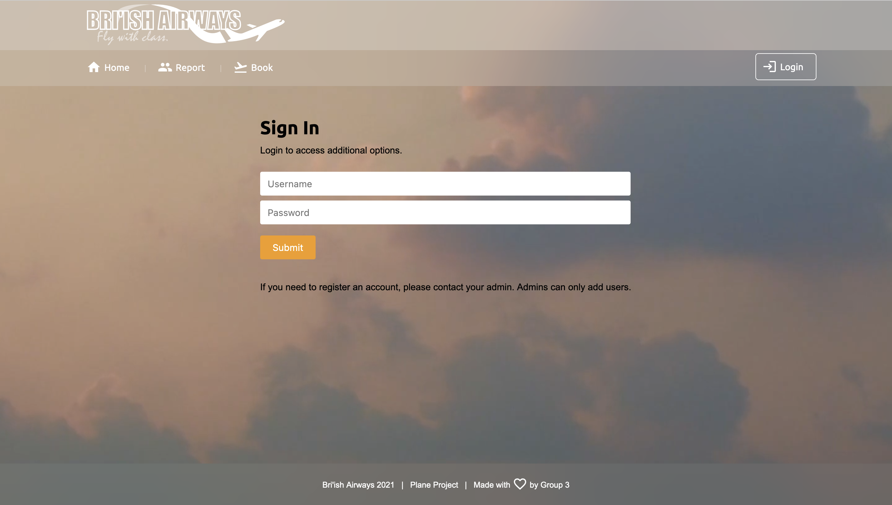
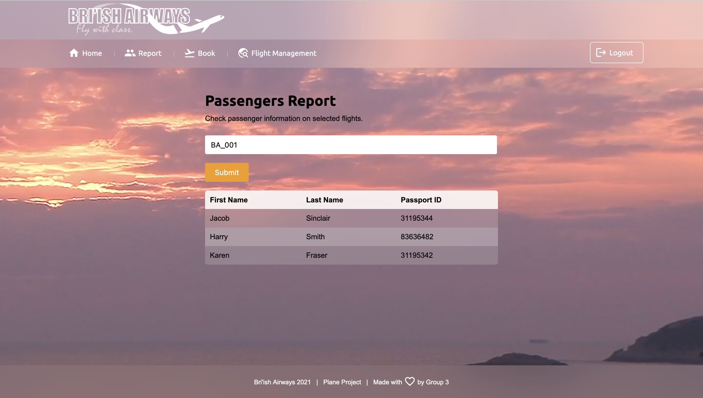

# Bri'ish Airways
## Engineering 89: Group 3 - Plane Project

The aim of this project was to, as a team, complete a plane management program using python and a model view controller (MVC). We were given 5 days to complete this task and here is the result!

## Technologies used
To help us along the way we have used a few well known technololgies:

### [Flask](https://flask.palletsprojects.com/)
Flask was used as our MVC and helped to create the link between a public facing website and the underlying code. Flask uses HTML templates to generate standard web pages with the relevant content for the user:

Using flask has a number of benefits including:
- Speed: Flask is very quick at generating pages
- Compatibility: Since flask is generating simple web pages, no special hardware/software is required to run or view the program
- Standards: HTML pages are ubiquitous across the internet so all the standard tools can be used including CSS, JavaScript, SQL etc.

### [WTForms](https://flask-wtf.readthedocs.io)
WTForms was used to handle user inputs. These simple forms allow us to transport user inputs to where they need to be. It also has support for things like password forms to help obscure sensitive information as it is entered in. Cookies could be handled this way too allowing for our site to remember a user over multiple different sessions, useful if you are an employee who may be using this system regularly

### [SQLite](https://sqlite.org/)
SQLite was chosen as our database, this allowed us to not only provide a storage medium for our database tables and entries in the form of `*.db` files, but it also allowed for us to run queries natively in SQL meaning that operations could be performed in the database rather than in Python which increased the speed at which queries could be run since the data wouldn't have to leave the database at all unless absolutely necessary.

### [passlib](https://passlib.readthedocs.io)
Passlib was used to help keep sensitive information, private. We used the pbkdf2-SHA256 encryption method to hash and salt all passwords, so, for example, the password `password` might be entered in to the database as: `$pbkdf2-sha256$29000$nrN27t2bkxIixDinNGYsZQ$mWBaSsjFddGJRrq4Xnr4a36IQZRonEtSqsBvFrcTb6s`. That being said, because of the nature of the algorithm, it might not always be entered in as such adding that extra layer of security.

## How to run
Head over to our [wiki](https://github.com/engineering89-plane-project-group-3/project/wiki) for detailed instructions on how to download and run our project. There may be some installation required but your Python environment should make you aware of anything you may be missing!